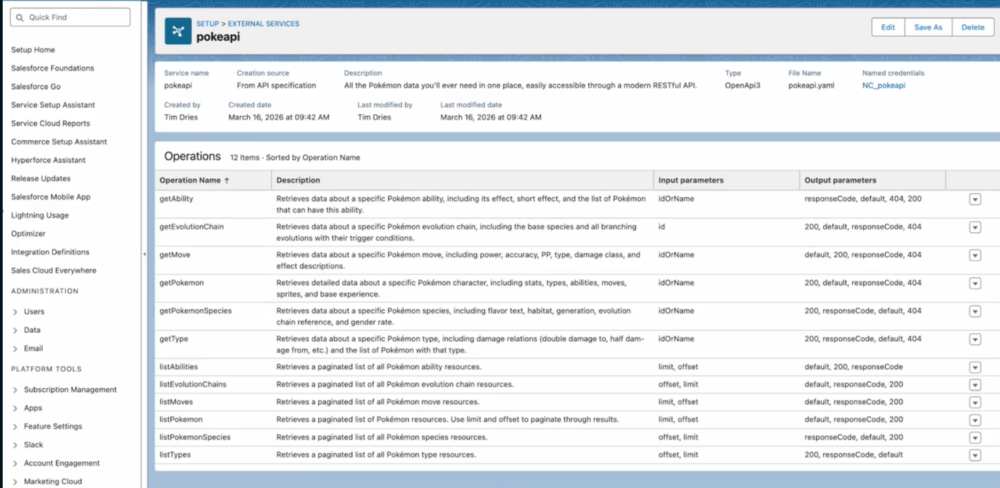

<p align="center">
  
</p>

# agentforce-ai-api-to-actions

**Register any external API as a Salesforce Agentforce action — in seconds.**

[](https://www.youtube.com/watch?v=P6uatEaLpY8&t=51s)

Paste a link to any API documentation (OpenAPI spec or HTML docs page) and agentforce-ai-api-to-actions will:

1. Fetch and parse the documentation
2. Use Claude to generate or normalize a valid OpenAPI 3.0 spec
3. Package it as Salesforce metadata (External Service Registration + Named Credential)
4. Deploy it directly to your Salesforce org via the Metadata API

The registered service immediately appears in Agent Studio as a set of callable actions.

---

## Prerequisites

| Requirement | Notes |
|---|---|
| Python 3.10+ | |
| [Anthropic API key](https://console.anthropic.com) | Claude Sonnet is used for spec generation |
| Salesforce org | Developer Edition, sandbox, or production |
| Salesforce user with **Modify Metadata Through Metadata API Functions** permission | Required for the deploy call |

---

## Setup

```bash
git clone https://github.com/your-org/agentforce-ai-api-to-actions.git
cd agentforce-ai-api-to-actions

pip install -r requirements.txt

cp .env.example .env
# Fill in your credentials (see Configuration below)

uvicorn main:app --reload
# Open http://localhost:8000
```

---

## Configuration

Credentials can be set in `.env` **or** entered directly in the UI on each run. The UI fields take precedence over `.env` when filled in.

```env
# Anthropic
ANTHROPIC_API_KEY=sk-ant-...

# Salesforce
SF_INSTANCE_URL=https://yourorg.my.salesforce.com
SF_USERNAME=user@yourorg.com
SF_PASSWORD=yourpassword
SF_SECURITY_TOKEN=yoursecuritytoken   # leave blank if your IP is whitelisted

# Optional
SF_API_VERSION=61.0
```

> **Note:** `SF_INSTANCE_URL` accepts a full org URL (`https://yourorg.my.salesforce.com`) or the plain hostname. For sandbox orgs, use `https://test.salesforce.com` or your sandbox My Domain URL.

---

## Usage

1. Open [http://localhost:8000](http://localhost:8000)
2. Paste an **API Documentation URL** — either:
   - A direct OpenAPI / Swagger spec (`.yaml`, `.json`)
   - Any HTML documentation page
3. Optionally set a **Service Name** (auto-detected from the URL if left blank)
4. Expand **Salesforce credentials** if not using `.env`
5. Click **Register API**

Progress is streamed in real time. On success, a link opens directly to the External Services page in Salesforce Setup.

**Example:** agentforce-ai-api-to-actions works on plain HTML documentation pages — no OpenAPI spec required.



### After registration

In **Agent Studio**:
- Create or open a Topic
- Add Action → External Service → select actions from your newly registered service

If the API requires an API key or auth header, configure it on the generated Named Credential (`NC_<ServiceName>`) in Salesforce Setup.

---

## How it works

```
POST /register  →  SSE stream
│
├─ 1. Salesforce login       SOAP partner API → session token
├─ 2. Fetch docs             HTTP GET → HTML or spec content
├─ 3. Generate spec          Claude Sonnet → OpenAPI 3.0 YAML
├─ 4. Build metadata ZIP     ExternalServiceRegistration + NamedCredential XML
├─ 5. Deploy                 Metadata API deploy()
└─ 6. Poll status            checkDeployStatus() every 4 s until done
```

The frontend consumes the SSE stream and renders live step progress.

### Metadata deployed

```
package.xml
externalServiceRegistrations/<Name>.externalServiceRegistration-meta.xml
externalServiceRegistrations/<Name>.yaml
namedCredentials/NC_<Name>.namedCredential-meta.xml
```

Named Credentials are created with `NoAuthentication` by default. The External Service Registration uses `schemaType=OpenApi3_0` with the spec embedded inline.

---

## Limitations

- Max 20 operations per service (Salesforce External Services limit)
- APIs behind authentication walls (login walls, OAuth flows) can't be fetched directly — use a direct spec URL instead
- The generated Named Credential uses no authentication; add credentials manually in Salesforce Setup after deployment
- Tested against Salesforce API version 61.0 (Winter '25)

---

## Stack

- **Backend:** Python / FastAPI, streaming via SSE
- **AI:** Anthropic Claude Sonnet (`claude-sonnet-4-6`)
- **Salesforce:** SOAP Metadata API (no connected app required)
- **Frontend:** Vanilla JS, single `index.html`

---

Built by [Biztory](https://www.biztory.com) · Data + AI Activation for Salesforce
